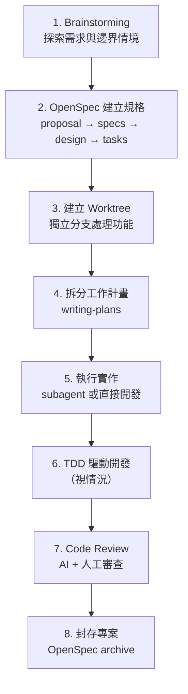

# AI 輔助開發流程

本文件描述在此專案中，如何結合 **Superpowers**（Claude Code 技能系統）與 **OpenSpec**（規格驅動工作流）進行 AI 輔助開發。整套流程將需求從模糊構想推進到可驗證的實作，每一階段都有明確的產出物與品質關卡。

---

## 流程總覽



---

## 步驟詳解

### 1. Brainstorming — 探索需求與邊界情境

**使用工具：** Superpowers `brainstorming` skill 或 OpenSpec `/opsx:explore`

在動手寫任何程式碼之前，先透過 AI 進行發散式思考：

- 釐清需求的模糊地帶與隱含假設
- 列舉 edge cases 與可能的失敗情境
- 以 ASCII 圖表視覺化架構或資料流
- 評估技術選型的 trade-offs

**產出：** 對需求的完整理解、已識別的風險清單

**實際案例：** 在 `hero-features` 開發前，透過 brainstorming 識別出快速切換英雄的 race condition、能力值編輯的邊界條件（remaining = 0 時按增加、ability = 0 時按減少）等問題，並預先規劃解決方案。

---

### 2. OpenSpec 建立規格

**使用工具：** `/opsx:new`（逐步）或 `/opsx:ff`（快速）

建立結構化的變更規格，產出以下 artifacts：

| Artifact | 內容 | 檔案位置 |
|----------|------|----------|
| **Proposal** | 為什麼要做、做什麼、影響範圍 | `openspec/changes/<name>/proposal.md` |
| **Specs** | 需求規格、使用情境、驗收條件 | `openspec/changes/<name>/specs/` |
| **Design** | 技術設計、元件架構、API 設計 | `openspec/changes/<name>/design/` |
| **Tasks** | 可執行的任務清單（每項 ≤ 2 小時） | `openspec/changes/<name>/tasks/` |

OpenSpec 的 `config.yaml` 提供專案全域 context（tech stack、架構慣例、設計系統參考），確保 AI 產出的 artifacts 與現有架構一致。

**實際案例：**
- `hero-features` change：定義了 hero-list、hero-profile、app-shell 三個 capabilities
- `add-config-design-routing-conventions` change：擴充 config.yaml 以改善後續 AI 產出品質

**關鍵原則：**
- Proposal 使用繁體中文、500 字以內
- Tasks 控制在 2 小時以內
- API 相關 task 遵循四層架構（api → app → transform → dto）

---

### 3. 建立 Worktree — 獨立處理功能

**使用工具：** Superpowers worktree 功能（`git worktree`）

為每個功能建立獨立的 git worktree：

```bash
git worktree add ../hahow-assessment-hero-features feature/hero-features
```

**好處：**
- 功能開發與主分支完全隔離
- 可同時進行多個功能的開發
- 避免未完成的變更影響其他工作
- AI agent 在獨立環境中操作，不會干擾主工作目錄

---

### 4. 拆分工作計畫

**使用工具：** Superpowers `writing-plans` skill

根據 OpenSpec 產出的 tasks，進一步拆分為可執行的工作計畫：

- 確認任務之間的依賴關係與執行順序
- 識別可平行處理的獨立任務
- 為每個步驟定義明確的完成標準
- 評估哪些任務適合 AI 自主執行、哪些需要人工介入

**產出：** 結構化的執行計畫，包含步驟、依賴、預期產出

---

### 5. 執行實作 — Subagent 或直接開發

**使用工具：** Claude Code Agent tool / 直接使用 Edit、Write 等工具

根據任務特性選擇執行方式：

| 情境 | 執行方式 | 說明 |
|------|---------|------|
| 獨立且明確的任務 | **Subagent** | 平行處理多個不相依的任務，如同時建立多個元件 |
| 需要上下文或 hands-off 的任務 | **直接執行** | 涉及跨檔案邏輯、需要即時決策的工作 |
| 探索性任務 | **Explore agent** | 需要深入了解現有程式碼再決定做法 |

---

### 6. TDD 驅動開發（視情況）

**使用工具：** Superpowers TDD skill

對於核心業務邏輯，採用 Test-Driven Development：

1. **Red** — 先寫失敗的測試，定義預期行為
2. **Green** — 寫最少量的程式碼讓測試通過
3. **Refactor** — 在測試保護下重構

**適用場景：**
- 純邏輯的 custom hooks（如 `useAbilityEditor`）
- 資料轉換函式（transform 層）
- 邊界條件密集的功能

**測試慣例：**
- 測試檔案與 source 同目錄（`*.test.ts`）
- MSW handlers 放在 feature 的 `mocks/` 目錄
- 使用 Vitest + MSW

---

### 7. Code Review — AI + 人工審查

**使用工具：** Superpowers `code-review` skill

雙層審查機制確保實作品質：

**AI Review（自動）：**
- 比對實作與 OpenSpec 規格的一致性
- 檢查程式碼風格與架構慣例
- 識別潛在的效能問題與安全漏洞
- 驗證測試覆蓋率

**人工 Review（手動）：**
- 審查 AI 的 review 結果
- 確認業務邏輯的正確性
- 評估 UX 與 accessibility
- 最終決策是否合併

---

### 8. 封存專案 — OpenSpec Archive

**使用工具：** `/opsx:archive` 或 `/opsx:bulk-archive`

完成實作後，將 change 封存以保留決策歷程：

1. **驗證完整性** — 檢查所有 artifacts 與 tasks 是否完成
2. **同步規格** — 將 delta specs 合併到主規格（`/opsx:sync`）
3. **封存** — 移動至 `openspec/changes/archive/YYYY-MM-DD-<name>/`

**封存後的結構：**
```
openspec/changes/archive/2026-03-14-add-config-design-routing-conventions/
├── .openspec.yaml     # 建立日期等 metadata
├── proposal.md        # 原始提案（凍結）
└── specs/             # 規格快照（凍結）
```

**價值：**
- 完整的決策歷史可追溯
- 新成員可透過 archive 了解每個功能的設計背景
- AI 可參考歷史 change 產出更一致的新 artifacts

---

## 工具對照表

| 流程階段 | Superpowers Skill | OpenSpec Command | 產出物 |
|----------|------------------|------------------|--------|
| 探索需求 | `brainstorming` | `/opsx:explore` | 需求理解、風險清單 |
| 建立規格 | — | `/opsx:new`, `/opsx:ff` | proposal, specs, design, tasks |
| 建立分支 | `worktree` | — | 獨立工作目錄 |
| 拆分計畫 | `writing-plans` | — | 結構化執行計畫 |
| 執行實作 | `/executing-plans` | — | 程式碼 |
| TDD 開發 | `tdd` | — | 測試 + 程式碼 |
| Code Review | `code-review` | `/opsx:verify` | Review 報告 |
| 封存 | — | `/opsx:archive` | 凍結的 change 記錄 |

---

## 何時不使用完整流程

並非所有變更都需要走完八個步驟：

| 變更類型 | 建議流程 |
|----------|---------|
| 修改部分需求的 config | 直接改，不需要 OpenSpec |
| 小型 bug fix 或介面、邏輯 | Brainstorming → 直接修 → Review |
